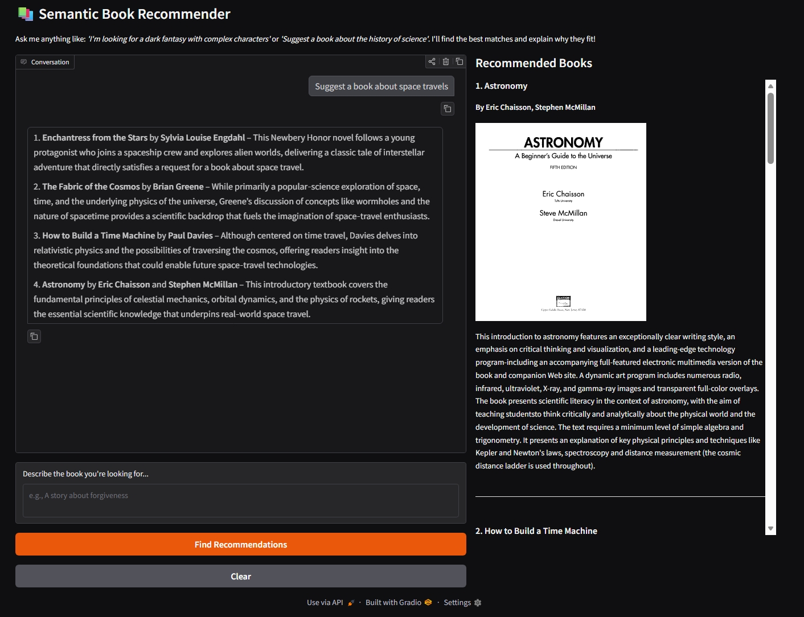

# 📚 Semantic Book Recommender

RAG book recommendation system.



## ✨ Features

- **Semantic Search**: Finds books based on themes, moods, and plot descriptions using `BAAI/bge-small-en-v1.5` embeddings.
- **Conversational AI**: Integrated with Cerebras service to explain _why_ specific books were recommended.
- **Hybrid UI**: A modern Gradio interface featuring a conversational chatbot and a rich Markdown-based book gallery.
- **Local Persistence**: Uses ChromaDB for fast, local vector storage and retrieval.

## 🛠️ Tech Stack

- **Language**: Python
- **AI/ML**: `langchain`, `ChromaDB`
- **LLM Provider**: Cerebras
- **UI**: `gradio`
- **Data**: `pandas`, `numpy`

## 🚀 Getting Started

### 1. Clone the Repository

```bash
git clone <your-repo-url>
cd lm-book-recomm
```

### 2. Install Dependencies

We recommend using `uv` for fast package management:

```bash
uv pip install -r requirements.txt
```

### 3. Set Up Environment Variables

Create a `.env` file in the root directory and add your Cerebras API key:

```env
OPENAI_API_KEY=your_cerebras_api_key_here
OPENAI_API_BASE=https://api.cerebras.ai/v1
MODEL_ID=gpt-oss-120b
```

### 4. Run the Application

```bash
python gradio_app.py
```

_Note: The first run will automatically index the `books_cleaned.csv` dataset into the `chroma_db` directory._

## 📂 Project Structure

- `gradio_app.py`: The main entry point for the web application.
- `books_cleaned.csv`: The primary dataset (5,000+ books).
- `vector_search.ipynb`: Development notebook for testing vector search logic.
- `data_exploration.ipynb`: Initial data analysis and cleaning.
- `chroma_db/`: Local directory for the persisted vector database.
- `fastembed_cache/`: Directory for cached embedding models.

## 📄 License

This project is open-source and available under the MIT License.
